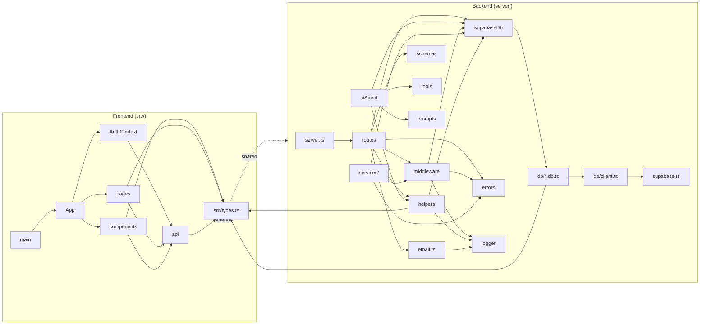

# SmartPen Academy — Architecture Graph

> **Generated**: 2026-09-21 | **Method**: Direct file scan + import tracing (no guessing)  
> **Stack**: React 18 + Vite (frontend) · Node.js + Express + TypeScript (backend) · Supabase PostgreSQL (persistence) · Google Gemini AI

---

## 1. High-Level Architecture Diagram

```mermaid
graph TB
    subgraph CLIENT["Client (Browser)"]
        MAIN["main.tsx\nHydrate / Render root"]
        APP["App.tsx\nRouter + Auth guards"]
        AUTH_CTX["AuthContext.tsx\nGlobal session state"]
        
        subgraph PAGES["Pages"]
            LP["LandingPage"]
            ADP["AdminDashboardPage"]
            SDP["StudentDetailPage"]
            PPP["ParentPortalPage"]
            EP["EnrollmentPage"]
            AUP["AboutUsPage"]
        end

        subgraph COMPONENTS["Components"]
            NB["Navbar"]
            FT["Footer"]
            LM["LoginModal"]
            DBM["DemoBookingModal"]
            AIC["AIAgentChatWidget"]
            AICORE["SmartPenAIAgentCore"]
            ACT["AttendanceCalendarTracker"]
            FLT["FeeLedgerTracker"]
            PRC["ProgressReportCard"]
            CERT["CertificateModal"]
            CAM["CameraCaptureModal"]

            subgraph ADMIN_COMP["Admin Components"]
                DADH["useAdminDashboardData (hook)"]
                STAB["StudentsTab"]
                CTAB["CoachesTab"]
                CATAB["CoachAssignmentTab"]
                CETAB["CoachEnrollmentTab"]
                ATAB["AlertsTab"]
                TTAB["TestimonialsTab"]
                ECMOD["EditCoachModal"]
                QAMOD["QuickAttendanceModal"]
                QFMOD["QuickFeeModal"]
                QCAMOD["QuickCoachAssignModal"]
                BKMOD["BookingNotesModal"]
                DLMOD["DeleteBookingModal"]
            end

            subgraph UI_COMP["UI Primitives"]
                BTN["Button"]
                MDL["Modal"]
                FF["FormField"]
                INP["Input"]
                SEL["Select"]
                TOA["Toast"]
                AVT["Avatar"]
                STC["StatCard"]
            end
        end

        subgraph SERVICES["services/api.ts\n(API Client Layer)"]
            API["api object\n~50 typed methods"]
        end

        MAIN --> APP
        APP --> AUTH_CTX
        APP --> PAGES
        APP --> NB
        APP --> FT
        APP --> LM
        APP --> DBM
        APP --> AIC

        LP --> AIC
        LP --> AICORE
        ADP --> DADH
        ADP --> STAB
        ADP --> CTAB
        ADP --> CATAB
        ADP --> CETAB
        ADP --> ATAB
        ADP --> TTAB

        PAGES --> API
        ADMIN_COMP --> API
        LM --> API
        DBM --> API
        ACT --> API
        FLT --> API
        AICORE --> API
        AUTH_CTX --> API
    end

    subgraph SERVER["Server (Express · Node.js)"]
        ENTRY["server.ts\nBootstrap orchestrator"]

        subgraph MIDDLEWARE["Middleware"]
            AUTHMW["auth.ts\nauthenticateJwt · requireAdmin\nrequireCoachOrAdmin · verifyStudentAccess"]
            ERRMW["errorHandler.ts\nasyncHandler · errorHandler"]
            RLMW["rateLimiter.ts\ncreateRateLimiter (Supabase-backed)"]
        end

        subgraph ROUTES["Routes (server/routes/)"]
            AUTHR["auth.routes.ts"]
            STUDR["students.routes.ts"]
            COAR["coaches.routes.ts"]
            ATTR["attendance.routes.ts"]
            FEER["fees.routes.ts"]
            PROGT["progressTrackers.routes.ts"]
            REPR["reports.routes.ts"]
            SWRK["studentWorks.routes.ts"]
            REMR["reminders.routes.ts"]
            DEMBR["demoBookings.routes.ts"]
            ALRR["alerts.routes.ts"]
            TESTR["testimonials.routes.ts"]
            AIR["ai.routes.ts"]
            HLR["health.routes.ts"]
            LOGR["logs.routes.ts"]
        end

        subgraph AI_ENGINE["AI Engine (server/)"]
            AIAG["aiAgent.ts\nhandleAIAgentChat · executeTool"]
            TOOLS_REG["tools/registry.ts\ntoolRegistry (48 tools)"]
            TOOL_IMPL["tools/*.ts\n(48 AgentTool implementations)"]
            INTENT["helpers/intentRouter.ts\ndetectIntent"]
            AGPROMPT["prompts/agentPrompts.ts\nbuildRoleSystemInstruction"]
        end

        subgraph SERVICES_SV["Services (server/services/)"]
            AUTH_SVC["auth.service.ts\nAuthService.authenticateUser"]
        end

        subgraph HELPERS["Helpers (server/helpers/)"]
            AUDIT_H["audit.ts\nrecordAudit · sanitizeAuditArguments"]
            SESSION_H["sessionHelper.ts\nissueUserSession"]
            STUDENT_CTX["studentContext.ts\nresolveStudentContext"]
            CONFIRM_H["confirmationToken.ts"]
            INTENT_H["intentRouter.ts"]
            FILE_H["fileHelper.ts"]
            COACH_H["coachHelper.ts"]
        end

        subgraph DB_LAYER["Database Layer (server/db/)"]
            DBFACADE["supabaseDb.ts\nSupabaseDatabase facade + db"]
            AUTH_DB["auth.db.ts\nauthDb"]
            STUD_DB["students.db.ts\nstudentsDb"]
            COACH_DB["coaches.db.ts\ncoachesDb"]
            ATT_DB["attendance.db.ts\nattendanceDb"]
            FEE_DB["fees.db.ts\nfeesDb"]
            PROG_DB["progress.db.ts\nprogressDb"]
            DEMO_DB["demoBookings.db.ts\ndemoBookingsDb"]
            ALERT_DB["alerts.db.ts\nalertsDb"]
            TEST_DB["testimonials.db.ts\ntestimonialsDb"]
            AUDIT_DB["audit.db.ts\nauditDb"]
            DB_CLIENT["db/client.ts\ngetSupabase · pagination helpers"]
        end

        INFRA["server/supabase.ts\nserverSupabase (service-role client)"]
        EMAIL["server/email.ts\nResend email service"]
        LOGGER["server/logger.ts\nLogger.get(domain)"]
        ERRORS["server/errors.ts\nAppError hierarchy"]
        SCHEMAS["server/schemas.ts\nZod shared schemas"]

        ENTRY --> ROUTES
        ENTRY --> MIDDLEWARE
        ROUTES --> AUTHMW
        ROUTES --> RLMW
        ROUTES --> ERRMW
        ROUTES --> DBFACADE
        ROUTES --> AUDIT_H
        ROUTES --> EMAIL
        
        AUTHR --> AUTH_SVC
        AUTHR --> SESSION_H

        AIR --> AIAG
        AIAG --> TOOLS_REG
        AIAG --> INTENT
        AIAG --> AGPROMPT
        TOOLS_REG --> TOOL_IMPL
        TOOL_IMPL --> DBFACADE
        TOOL_IMPL --> EMAIL

        AUTHMW --> DBFACADE
        RLMW --> DBFACADE

        AUTH_SVC --> DBFACADE
        SESSION_H --> DBFACADE
        AUDIT_H --> DBFACADE
        STUDENT_CTX --> DBFACADE

        DBFACADE --> AUTH_DB
        DBFACADE --> STUD_DB
        DBFACADE --> COACH_DB
        DBFACADE --> ATT_DB
        DBFACADE --> FEE_DB
        DBFACADE --> PROG_DB
        DBFACADE --> DEMO_DB
        DBFACADE --> ALERT_DB
        DBFACADE --> TEST_DB
        DBFACADE --> AUDIT_DB

        AUTH_DB --> DB_CLIENT
        STUD_DB --> DB_CLIENT
        COACH_DB --> DB_CLIENT
        ATT_DB --> DB_CLIENT
        FEE_DB --> DB_CLIENT
        PROG_DB --> DB_CLIENT
        DEMO_DB --> DB_CLIENT
        ALERT_DB --> DB_CLIENT
        TEST_DB --> DB_CLIENT
        AUDIT_DB --> DB_CLIENT
        STUD_DB --> AUTH_DB

        DB_CLIENT --> INFRA
        ERRMW --> ERRORS
        ERRMW --> LOGGER
    end

    subgraph EXTERNAL["External Systems"]
        SUPABASE_PG["Supabase PostgreSQL\n(+ RLS)"]
        RESEND["Resend Email API"]
        GEMINI["Google Gemini API\n(generativelanguage.googleapis.com)"]
    end

    SHARED["src/types.ts\nShared TypeScript contracts\n(User, StudentProfile, FeeRecord, etc.)"]

    API -->|"HTTP fetch /api/*"| ROUTES
    INFRA --> SUPABASE_PG
    EMAIL --> RESEND
    AIAG --> GEMINI
    CLIENT --> SHARED
    SERVER --> SHARED
```

---

## 2. Module/Package Dependency Graph

---

## 3. Function & Component Call Hierarchy

### 3a. Frontend Call Chain

| Caller | Relation | Callee |
|--------|----------|--------|
| `main.tsx` | renders | `<ErrorBoundary>` → `<App>` |
| `App` (default export) | renders | `<AuthProvider>` → `<MainApp>` |
| `MainApp` | consumes | `useAuth()` from `AuthContext` |
| `MainApp.renderView()` | routes to | `LandingPage` · `AboutUsPage` · `EnrollmentPage` · `AdminDashboardPage` · `StudentDetailPage` · `ParentPortalPage` |
| `AdminDashboardPage` | calls hook | `useAdminDashboardData()` |
| `useAdminDashboardData` | calls | `api.getStudents()` · `api.getCoaches()` · `api.getAlerts()` · `api.getDemoBookings()` |
| `LoginModal` | calls | `api.login()` · `api.selectRole()` · `api.selectStudent()` · `api.forgotPassword()` · `api.resetPasswordWithToken()` |
| `LoginModal` | calls | `useAuth().login()` on success |
| `AuthContext.login()` | writes | `localStorage.smartpen_token` |
| `AuthContext.logout()` | calls | `fetch('/api/auth/logout')` |
| `AuthContext.switchStudent()` | calls | `api.switchStudent()` |
| `AuthContext.validateStoredSession()` | calls | `fetch('/api/auth/session')` |
| `DemoBookingModal` | calls | `api.createDemoBooking()` |
| `AttendanceCalendarTracker` | calls | `api.getAttendanceByStudent()` · `api.saveAttendanceBatch()` · `api.deleteAttendance()` |
| `FeeLedgerTracker` | calls | `api.getFeesByStudent()` · `api.saveFee()` · `api.updateFee()` · `api.deleteFee()` · `api.sendFeeReminder()` |
| `SmartPenAIAgentCore` | calls | `api.sendAIChat()` |
| `AIAgentChatWidget` | renders | `SmartPenAIAgentCore` |
| `CoachEnrollmentTab` | calls | `api.createCoach()` |
| `EditCoachModal` | calls | `api.updateCoach()` |
| `QuickAttendanceModal` | calls | `api.addAttendance()` |
| `QuickFeeModal` | calls | `api.saveFee()` · `api.addFeeRecord()` |
| `TestimonialsTab` | calls | `api.getTestimonials()` · `api.updateTestimonial()` |
| `EnrollmentPage` | calls | `api.enrollStudent()` |
| `StudentDetailPage` | calls | `api.getStudent()` · `api.updateStudent()` · `api.getProgressTrackers()` · `api.getStudentWorks()` · `api.getProgressReports()` |
| `ParentPortalPage` | calls | `api.getStudent()` · `api.getFeesByStudent()` · `api.getProgressReports()` · `api.getStudentWorks()` · `api.getTestimonialsByStudent()` · `api.submitTestimonial()` |
| `api.*` | HTTP fetch | `/api/*` endpoints |

### 3b. Backend Call Chain — Request Lifecycle

| Caller | Relation | Callee |
|--------|----------|--------|
| `startServer()` in `server.ts` | mounts | All 15 domain routers |
| `server.ts` | applies globally | `cookieParser` · `helmet` · `express.json` · `errorHandler` |
| `authRouter POST /login` | applies | `authRateLimiter` → `asyncHandler` |
| `authRouter POST /login` | calls | `authService.authenticateUser()` |
| `authService.authenticateUser()` | calls | `db.findUsersByIdentifier()` → `authDb.findUsersByIdentifier()` |
| `authService.authenticateUser()` | calls | `bcrypt.compare()` |
| `authRouter POST /login` | calls | `issueUserSession()` |
| `issueUserSession()` | calls | `resolveStudentContext()` · `db.findUserTokenVersion()` · `jwt.sign()` |
| `authenticateJwt` middleware | calls | `jwt.verify()` · `db.findUserTokenVersion()` · `db.getCoachById()` |
| `requireAdmin` | checks | `req.user.role === 'admin'` |
| `canAccessStudent()` | calls | `db.getStudentById()` · `db.getSiblingStudentsForUser()` · `db.findUserById()` |
| `studentsRouter POST /enroll` | calls | `db.checkStudentDuplicate()` · `db.createStudent()` · `sendEnrollmentEmails()` · `recordAudit()` |
| `attendanceRouter POST /batch` | calls | `db.saveAttendanceBatch()` · `recordAudit()` |
| `feesRouter POST /` | calls | `db.saveFeeRecord()` · `recordAudit()` |
| `remindersRouter POST /send` | calls | `db.saveFeeReminder()` · `sendFeeReminderEmail()` |
| `demoBookingsRouter POST /` | calls | `db.createDemoBooking()` · `sendDemoBookingAlert()` |
| `aiRouter POST /agent-chat` | calls | `handleAIAgentChat()` |
| `handleAIAgentChat()` | calls | `detectIntent()` (fast-path) |
| `handleAIAgentChat()` | calls | `buildRoleSystemInstruction()` · `getToolsForRole()` |
| `handleAIAgentChat()` | calls | `GoogleGenAI.models.generateContent()` |
| `handleAIAgentChat()` | calls | `executeTool(fc.name, fc.args, ...)` for each function call |
| `executeTool()` | calls | `checkToolRateLimit()` → `db.checkRateLimit()` |
| `executeTool()` | calls | `isToolAllowedForRole()` |
| `executeTool()` | calls | `tool.execute()` (from `toolRegistry`) |
| `tool.execute()` (any AgentTool) | calls | `db.*` methods (domain-specific) |
| `recordAudit()` | calls | `sanitizeAuditArguments()` · `sanitizeAuditSummary()` · `db.recordToolAuditLog()` |
| `db.*` (SupabaseDatabase facade) | delegates to | Domain `*.db.ts` repository |
| `*.db.ts` (all) | calls | `getSupabase()` from `db/client.ts` |
| `getSupabase()` | returns | `serverSupabase` from `supabase.ts` |
| `serverSupabase` | queries | Supabase PostgreSQL via PostgREST |
| `email.ts` functions | calls | Resend API |

---

## 4. Data Flow — Key Interfaces Across Boundaries

```mermaid
graph LR
    subgraph TYPES["src/types.ts (Shared Contract)"]
        User
        SessionUser
        StudentProfile
        CoachProfile
        AttendanceRecord
        FeeRecord
        ProgressTracker
        ProgressReport
        StudentWorkImage
        FeeReminder
        DemoBooking
        AdminAlert
        Testimonial
        ToolAuditLog
        ROLES["ROLES const"]
    end

    subgraph FE_BOUNDARY["Frontend → API boundary"]
        API_CALL["api.method(args: TypedPayload)\nfetch('/api/...')"]
    end

    subgraph BE_BOUNDARY["Express Route → DB boundary"]
        ZOD["Zod schema.parse(req.body)\nValidated payload"]
        DB_CALL["db.method(validated) → domain*.db.ts\n→ supabase.from('table').select/insert/update"]
    end

    subgraph DB_ROW["Supabase PostgreSQL row"]
        ROW["snake_case columns\n(e.g. first_name, student_id)"]
    end

    subgraph MAPPING["DB Mapping (*.db.ts)"]
        MAP["mapUserRow / mapStudentRow / mapCoachRow\nsnake_case → camelCase TS types"]
    end

    FE_BOUNDARY -->|"fetch + Bearer token"| BE_BOUNDARY
    ZOD -->|"structured TS object"| DB_CALL
    DB_CALL --> ROW
    ROW --> MAP
    MAP -->|"returns"| TYPES
    TYPES -->|"imported by"| FE_BOUNDARY
    TYPES -->|"imported by"| BE_BOUNDARY
```

### Shared Type Usage Matrix

| Type | Frontend Consumers | Backend Consumers |
|------|--------------------|-------------------|
| `User` / `SessionUser` | `AuthContext`, `App`, most pages | `auth.db.ts`, `auth.service.ts`, `authAgent.ts`, all routes |
| `StudentProfile` | `StudentDetailPage`, `ParentPortalPage`, `AdminDashboardPage`, `EnrollmentPage`, `useAdminDashboardData` | `students.db.ts`, `students.routes.ts`, tools |
| `CoachProfile` | `AdminDashboardPage`, `CoachesTab`, `EditCoachModal`, `CoachEnrollmentTab` | `coaches.db.ts`, `coaches.routes.ts`, tools |
| `AttendanceRecord` | `AttendanceCalendarTracker`, `StudentDetailPage` | `attendance.db.ts`, `attendance.routes.ts` |
| `FeeRecord` | `FeeLedgerTracker`, `StudentDetailPage`, `ParentPortalPage` | `fees.db.ts`, `fees.routes.ts` |
| `ProgressTracker` | `ProgressReportCard`, `StudentDetailPage` | `progress.db.ts`, `progressTrackers.routes.ts` |
| `ProgressReport` | `StudentDetailPage`, `ParentPortalPage` | `progress.db.ts`, `reports.routes.ts` |
| `DemoBooking` | `AdminDashboardPage`, `AlertsTab` | `demoBookings.db.ts`, `demoBookings.routes.ts` |
| `AdminAlert` | `AlertsTab`, `useAdminDashboardData` | `alerts.db.ts`, `alerts.routes.ts` |
| `Testimonial` | `TestimonialsTab`, `ParentPortalPage` | `testimonials.db.ts`, `testimonials.routes.ts` |
| `ToolAuditLog` | (admin audit view) | `audit.db.ts`, `ai.routes.ts` |
| `ROLES` | `App`, `AuthContext`, `LoginModal` | `auth.middleware.ts`, `auth.service.ts`, tools, all routes |

---

## 5. Adjacency List — Complete Import/Call Edges

### 5a. Frontend Import Graph

| Source | Relation | Target |
|--------|----------|--------|
| `main.tsx` | imports | `App`, `ErrorBoundary`, `index.css` |
| `App.tsx` | imports | `AuthContext` (AuthProvider, useAuth), `Navbar`, `Footer`, `LoginModal`, `DemoBookingModal`, `LandingPage`, `AboutUsPage`, `EnrollmentPage`, `AdminDashboardPage`, `StudentDetailPage`, `ParentPortalPage`, `AIAgentChatWidget`, `SmartPenAIAgentCore` (ChatMessage type), `src/types.ts` (ROLES) |
| `AuthContext.tsx` | imports | `src/types.ts`, `services/api.ts` |
| `LandingPage` | imports | `services/api.ts`, `AuthContext`, `src/types.ts`, `properties/landing.properties.ts` |
| `EnrollmentPage` | imports | `services/api.ts`, `src/types.ts`, `properties/enrollment.properties.ts`, `validation/enrollmentForm.schema.ts` |
| `AdminDashboardPage` | imports | `hooks/useAdminDashboardData`, admin tabs, admin modals |
| `StudentDetailPage` | imports | `services/api.ts`, `AuthContext`, `AttendanceCalendarTracker`, `FeeLedgerTracker`, `ProgressReportCard`, `CertificateModal`, `CameraCaptureModal` |
| `ParentPortalPage` | imports | `services/api.ts`, `AuthContext`, `FeeLedgerTracker`, `ProgressReportCard`, `CertificateModal` |
| `useAdminDashboardData` | imports | `services/api.ts`, `AuthContext`, `src/types.ts`, `utils/clientError.ts` |
| `SmartPenAIAgentCore` | imports | `services/api.ts` |
| `AIAgentChatWidget` | imports | `SmartPenAIAgentCore` |
| `LoginModal` | imports | `services/api.ts`, `AuthContext`, `src/types.ts` |
| `DemoBookingModal` | imports | `services/api.ts` |
| `AttendanceCalendarTracker` | imports | `services/api.ts`, `src/types.ts` |
| `FeeLedgerTracker` | imports | `services/api.ts`, `src/types.ts` |
| `CoachEnrollmentTab` | imports | `services/api.ts` |
| `EditCoachModal` | imports | `services/api.ts` |
| `QuickAttendanceModal` | imports | `services/api.ts` |
| `QuickFeeModal` | imports | `services/api.ts` |
| `TestimonialsTab` | imports | `services/api.ts` |
| `services/api.ts` | imports | `src/types.ts` |
| `Navbar` | imports | `AuthContext` |

### 5b. Backend Import Graph

| Source | Relation | Target |
|--------|----------|--------|
| `server.ts` | imports | All 15 routers, `server/logger.ts`, `server/errors.ts`, `server/middleware/errorHandler.ts`, `server/middleware/auth.ts`, `server/middleware/rateLimiter.ts`, `server/helpers/audit.ts` |
| All route files | imports | `server/supabaseDb.ts` (via `{ db }`) |
| All route files except `health.routes.ts` and `logs.routes.ts` | imports | `server/helpers/audit.ts` (`recordAudit`) |
| `auth.routes.ts` | imports | `server/services/auth.service.ts`, `server/helpers/sessionHelper.ts`, `server/helpers/studentContext.ts`, `server/email.ts`, `server/schemas.ts`, `server/middleware/auth.ts`, `server/middleware/rateLimiter.ts` |
| `students.routes.ts` | imports | `server/email.ts` (`sendEnrollmentEmails`, `sendStudentUpdatedEmails`) |
| `reminders.routes.ts` | imports | `server/email.ts` (`sendFeeReminderEmail`) |
| `demoBookings.routes.ts` | imports | `server/email.ts` (`sendDemoBookingAlert`) |
| `ai.routes.ts` | imports | `server/aiAgent.ts` (`handleAIAgentChat`), `server/middleware/rateLimiter.ts` (`aiChatRateLimiter`) |
| `server/aiAgent.ts` | imports | `server/supabaseDb.ts`, `server/email.ts`, `server/tools/registry.ts`, `server/tools/helpers.ts`, `server/prompts/agentPrompts.ts`, `server/helpers/intentRouter.ts`, `server/helpers/audit.ts`, `src/properties/landing.properties.ts`, `src/types.ts` |
| `server/tools/registry.ts` | imports | All 48 `tools/*.ts` files |
| All `tools/*.ts` (all 48) | imports | `server/supabaseDb.ts` |
| `tools/sendFeeReminder.ts` | imports | `server/email.ts` |
| `tools/enrollStudent.ts` | imports | `server/email.ts` |
| `tools/bookDemoClass.ts` | imports | `server/email.ts` |
| `server/supabaseDb.ts` | imports | All 11 `server/db/*.db.ts` files |
| All `server/db/*.db.ts` | imports | `server/db/client.ts` |
| `server/db/students.db.ts` | imports | `server/db/auth.db.ts` (for `StoredUser` type) |
| `server/db/client.ts` | imports | `server/supabase.ts` |
| `server/middleware/auth.ts` | imports | `server/supabaseDb.ts`, `server/errors.ts`, `server/middleware/errorHandler.ts`, `src/types.ts` |
| `server/middleware/rateLimiter.ts` | imports | `server/supabaseDb.ts` |
| `server/middleware/errorHandler.ts` | imports | `server/errors.ts`, `server/logger.ts` |
| `server/helpers/audit.ts` | imports | `server/supabaseDb.ts`, `server/logger.ts`, `src/types.ts` |
| `server/helpers/sessionHelper.ts` | imports | `server/supabaseDb.ts`, `server/middleware/auth.ts`, `server/helpers/studentContext.ts` |
| `server/helpers/intentRouter.ts` | imports | `src/types.ts` |
| `server/services/auth.service.ts` | imports | `server/supabaseDb.ts`, `server/middleware/auth.ts`, `server/errors.ts`, `server/helpers/audit.ts`, `src/types.ts` |
| All `server/db/*.db.ts` | imports | `src/types.ts` |

---

## 6. Findings

### 6a. ⚠️ Layer Violations (Actual, Verified)

| Violation | Location | Detail | Status |
|-----------|----------|--------|--------|
| **Routes call `db` directly** | All 15 route files | Every route imports `{ db }` from `supabaseDb.ts` and calls it directly in handlers. This is a **direct route→DB coupling**, bypassing any service layer for all domains except auth. The service layer (`server/services/`) exists only for `auth.service.ts`. All other domains (students, coaches, fees, attendance, etc.) have no service layer intermediary — routes call the DB facade directly. | ℹ️ **ACCEPTED DESIGN** — Allowed per Architecture.md §13 (Modular Backend Architecture: routes delegate to DB persistence facade) |
| **`ai.routes.ts` duplicates auth middleware logic** | [`ai.routes.ts` L64–L106](file:///c:/Projects/SmartPenAcademy/server/routes/ai.routes.ts#L64-L106) | Instead of using `optionalAuthenticateJwt` middleware, the AI route manually re-implements the full JWT decode + token version check + inactive coach check inline. This is a copy of `authenticateJwt` logic. | ✅ **RESOLVED** — Route updated to delegate directly to `optionalAuthenticateJwt`. Inactive coach check added to `optionalAuthenticateJwt` for security parity. Inline duplication removed. |
| **`api.ts` returns synthetic ID in `addAttendance`** | [`api.ts` L406–L414](file:///c:/Projects/SmartPenAcademy/src/services/api.ts#L406-L414) | On success, the function returns a client-synthesized `AttendanceRecord` with `id: att_${Date.now()}` instead of reconciling the real DB-returned ID from `saveAttendanceBatch`. This is a **synthetic/optimistic ID leak** that violates Architecture.md §8 | ✅ **RESOLVED** — Reconciles real database record returned by backend in server response. Synthetic `att_${Date.now()}` eliminated. |

### 6b. 🔴 Orphan / Dead Exports (Zero Incoming Call Edges Found)

| Symbol | File | Note | Status |
|--------|------|------|--------|
| `HeroAgentPanel` | [`HeroAgentPanel.tsx`](file:///c:/Projects/SmartPenAcademy/src/components/HeroAgentPanel.tsx) | Exported component | ✅ **ACTIVE (False Positive)** — Verified active consumer in [`LandingPage.tsx`](file:///c:/Projects/SmartPenAcademy/src/pages/LandingPage.tsx#L33) (L33, L215) |
| `SmartPenLogo` | [`SmartPenLogo.tsx`](file:///c:/Projects/SmartPenAcademy/src/components/SmartPenLogo.tsx) | Exported logo component | ✅ **ACTIVE (False Positive)** — Verified active consumers in 6 files (`Navbar`, `Footer`, `LoginModal`, `LandingPage`, `ParentPortalPage`, `StarAchieverCertificate`) |
| `StarRating` | [`StarRating.tsx`](file:///c:/Projects/SmartPenAcademy/src/components/StarRating.tsx) | Standalone export component | ✅ **ACTIVE (False Positive)** — Verified active consumers in 4 files (`LandingPage`, `ParentPortalPage`, `StudentDetailPage`, `ProgressReportCard`) |
| `auditFromReq()` | [`server/helpers/audit.ts`](file:///c:/Projects/SmartPenAcademy/server/helpers/audit.ts#L99-L119) | Exported helper with zero incoming callers across repo | ⚠️ **PARKED (True Positive)** — Retained as shared utility; route handler migration from `recordAudit` parked (no runtime impact) |
| `confirmationToken.ts` | [`server/helpers/confirmationToken.ts`](file:///c:/Projects/SmartPenAcademy/server/helpers/confirmationToken.ts) | Confirmation token helper | ✅ **ACTIVE (False Positive)** — Verified active callers in 6 AI agent tools (`deactivateCoach`, `deleteAttendanceRecord`, `updateFeeStatus`, `recordFeePayment`, `deactivateStudent`, `bulkDeleteStudentWorks`) and `e2e-test-suite.ts` |
| `coachHelper.ts` | [`server/helpers/coachHelper.ts`](file:///c:/Projects/SmartPenAcademy/server/helpers/coachHelper.ts) | Coach assigned student resolution helper | ✅ **ACTIVE (False Positive)** — Verified active callers in 3 routes (`fees.routes.ts`, `attendance.routes.ts`, `students.routes.ts`) and 7 AI tools |
| `validation.ts` | [`server/helpers/validation.ts`](file:///c:/Projects/SmartPenAcademy/server/helpers/validation.ts) | Zod schema validation helper | ✅ **ACTIVE (False Positive)** — Verified active caller in [`fees.routes.ts`](file:///c:/Projects/SmartPenAcademy/server/routes/fees.routes.ts#L17) |
| `fileHelper.ts` | [`server/helpers/fileHelper.ts`](file:///c:/Projects/SmartPenAcademy/server/helpers/fileHelper.ts) | Image decoding/saving helper | ✅ **ACTIVE (False Positive)** — Verified active callers in [`studentWorks.routes.ts`](file:///c:/Projects/SmartPenAcademy/server/routes/studentWorks.routes.ts#L15), [`testimonials.routes.ts`](file:///c:/Projects/SmartPenAcademy/server/routes/testimonials.routes.ts#L8), and `e2e-test-suite.ts` |
| `EnrolledCoachSuccessModal` | [`admin/modals/EnrolledCoachSuccessModal.tsx`](file:///c:/Projects/SmartPenAcademy/src/components/admin/modals/EnrolledCoachSuccessModal.tsx) | Exported modal component | ✅ **ACTIVE (False Positive)** — Verified active consumer in [`AdminDashboardPage.tsx`](file:///c:/Projects/SmartPenAcademy/src/pages/AdminDashboardPage.tsx#L35) (L35, L566) |

### 6c. 🔁 Circular Dependencies

| Cycle | Detail | Status |
|-------|--------|--------|
| **`server/middleware/auth.ts` ↔ `server/services/auth.service.ts`** | `auth.service.ts` imports `getJwtSecret` from `server/middleware/auth.ts`. `auth.routes.ts` imports both. This is a **logical circular dependency** — service layer imports from middleware layer. | ✅ **RESOLVED** — Extracted `getJwtSecret()` into [`server/config/env.ts`](file:///c:/Projects/SmartPenAcademy/server/config/env.ts). Both middleware and service layers now cleanly import from config. |
| **`server/db/students.db.ts` → `server/db/auth.db.ts`** | `students.db.ts` was reported as importing `StoredUser` from `auth.db.ts`. | ✅ **VERIFIED CLEAN** — Verified in codebase: `students.db.ts` has zero imports from `auth.db.ts`. No cross-domain type coupling exists. |

### 6d. ✅ Architecture Invariants Verified

| Invariant | Status |
|-----------|--------|
| No route handlers added directly to `server.ts` | ✅ VERIFIED — `server.ts` is a pure bootstrapper (<231 lines, all mounts) |
| No raw `alert()`/`confirm()` in frontend | ✅ NOT FOUND — all confirmation uses `Modal` component |
| All DB queries routed through `server/db/*.db.ts` | ✅ VERIFIED |
| `supabaseDb.ts` is a pure facade (no query logic) | ✅ VERIFIED — all methods delegate to domain repos |
| Frontend API calls exclusively through `services/api.ts` | ✅ VERIFIED (except one raw `fetch` in `AuthContext` for session check and logout — acceptable pattern per Architecture.md) |
| JWT validated on every protected route | ✅ VERIFIED via `authenticateJwt` middleware |
| Rate limiting backed by Supabase atomic RPC | ✅ VERIFIED — `rateLimiter.ts` calls `db.checkRateLimit()` |
| No secrets prefixed `VITE_` | ✅ NOT FOUND in env or config files |
| AI tool execution goes through `executeTool()` with RBAC + rate-limit + audit | ✅ VERIFIED |

---

## 7. AI Agent Tool Registry Map

The `toolRegistry` in [`server/tools/registry.ts`](file:///c:/Projects/SmartPenAcademy/server/tools/registry.ts) exposes **48 AgentTools**. All call `db.*` through `server/supabaseDb.ts`.

| Category | Tools |
|----------|-------|
| **Public (no auth required)** | `getAboutUs`, `getCurriculum`, `getTestimonials`, `bookDemoClass`, `navigateToPage` |
| **Student self-service** | `viewOwnWorkSamples`, `viewOwnProgressReports`, `viewOwnTestimonials`, `submitTestimonial`, `switchActiveSibling` |
| **Coach + Admin** | `getAttendance`, `updateAttendance`, `deleteAttendanceRecord`, `getFeeStatus`, `recordFeePayment`, `updateFeeStatus`, `sendFeeReminder`, `getStudentProfile`, `listStudents`, `getStudentWorkSamples`, `getStudentProgressReports`, `uploadStudentWork`, `bulkDeleteStudentWorks`, `saveProgressTracker`, `generateProgressReport`, `explainStudentStatus` |
| **Admin-only** | `getAdminAlerts`, `markAlertRead`, `markAllAlertsRead`, `getDemoBookings`, `updateDemoBooking`, `listCoaches`, `editCoachProfile`, `assignCoachToStudent`, `enrollStudent`, `deactivateStudent`, `deactivateCoach`, `moderateTestimonial`, `getAdminTestimonials`, `getAuditLogs`, `getOverdueFeeSummary`, `getCoachWorkloadSummary`, `getAttendanceRiskStudents` |
| **Email-triggering** | `sendFeeReminder` → `sendFeeReminderEmail`, `enrollStudent` → `sendEnrollmentEmails`, `bookDemoClass` → `sendDemoBookingAlert` |

---

## 8. Legend

| Symbol | Meaning |
|--------|---------|
| → | Calls / imports / delegates to |
| ↔ | Bidirectional coupling |
| ⚠️ | Architectural concern |
| 🔴 | Likely dead code / orphan export |
| 🔁 | Circular dependency |
| ✅ | Invariant verified clean |
