# SmartPen Academy — Architecture Codegraph

> **Methodology**: Every edge in this graph was traced deterministically from actual `import` statements, `export` declarations, and call sites. No edges have been inferred from filenames or memory.
> **Generated**: 2026-09-23

---

## Table of Contents

1. [System Overview](#1-system-overview)
2. [Module/Package Dependency Map](#2-modulepackage-dependency-map)
3. [Mermaid Architecture Diagram](#3-mermaid-architecture-diagram)
4. [Function & Component Call Hierarchy](#4-function--component-call-hierarchy)
5. [Data Flow: Interfaces & Schemas](#5-data-flow-interfaces--schemas)
6. [Adjacency List](#6-adjacency-list)
7. [Flags: Orphans, Circular Dependencies, Layer Violations](#7-flags-orphans-circular-dependencies-layer-violations)

---

## 1. System Overview

SmartPen Academy is a **full-stack SSR-capable SPA** with the following top-level architecture:

| Layer | Technology | Root Entry |
|---|---|---|
| **Frontend** | React 18, TypeScript, Vite, Tailwind CSS | `src/main.tsx` |
| **Backend** | Node.js, Express, TypeScript | `server.ts` |
| **Database** | Supabase PostgreSQL (service-role key) | `server/supabase.ts` |
| **AI Engine** | Google Gemini (`@google/genai`) | `server/aiAgent.ts` |
| **Email** | Resend SDK | `server/email.ts` |
| **SSR Prerender** | Vite SSR | `src/entry-server.tsx` |

**Deployment target**: Render (single-process, stateless, binds `0.0.0.0:PORT`).

---

## 2. Module/Package Dependency Map

### Backend Package Dependency Tree

```
server.ts (bootstrap orchestrator)
├── server/logger.ts
├── server/errors.ts
├── server/middleware/errorHandler.ts  → server/errors.ts, server/logger.ts
├── server/middleware/auth.ts          → server/supabaseDb.ts, server/config/env.ts,
│                                        server/errors.ts, src/types.ts
├── server/middleware/rateLimiter.ts   → server/supabaseDb.ts, server/config/env.ts
├── server/routes/health.routes.ts
├── server/routes/auth.routes.ts       → server/supabaseDb.ts, server/services/auth.service.ts,
│                                        server/middleware/auth.ts, server/email.ts,
│                                        server/helpers/audit.ts, server/helpers/sessionHelper.ts,
│                                        server/helpers/studentContext.ts, server/schemas.ts,
│                                        server/errors.ts, server/logger.ts, src/types.ts
├── server/routes/coaches.routes.ts    → server/supabaseDb.ts, server/middleware/auth.ts,
│                                        server/helpers/audit.ts, server/errors.ts,
│                                        server/schemas.ts, src/types.ts
├── server/routes/students.routes.ts   → server/supabaseDb.ts, server/middleware/auth.ts,
│                                        server/helpers/audit.ts, server/helpers/coachHelper.ts,
│                                        server/email.ts, server/schemas.ts,
│                                        server/pagination.ts, server/errors.ts, src/types.ts
├── server/routes/attendance.routes.ts → server/supabaseDb.ts, server/supabase.ts [!VIOLATION],
│                                        server/middleware/auth.ts, server/helpers/audit.ts,
│                                        server/helpers/coachHelper.ts, server/schemas.ts,
│                                        server/pagination.ts, server/errors.ts, src/types.ts
├── server/routes/fees.routes.ts       → server/supabaseDb.ts, server/middleware/auth.ts,
│                                        server/helpers/audit.ts, server/helpers/coachHelper.ts,
│                                        server/helpers/validation.ts, server/schemas.ts,
│                                        server/pagination.ts, server/errors.ts, src/types.ts
├── server/routes/progressTrackers.routes.ts → server/supabaseDb.ts, server/middleware/auth.ts,
│                                              server/helpers/audit.ts, server/errors.ts
├── server/routes/reports.routes.ts    → server/supabaseDb.ts, server/middleware/auth.ts,
│                                        server/helpers/audit.ts, server/errors.ts, src/types.ts
├── server/routes/studentWorks.routes.ts → server/supabaseDb.ts, server/middleware/auth.ts,
│                                          server/helpers/audit.ts, server/helpers/fileHelper.ts,
│                                          server/errors.ts
├── server/routes/reminders.routes.ts  → server/supabaseDb.ts, server/middleware/auth.ts,
│                                        server/helpers/audit.ts, server/email.ts,
│                                        server/errors.ts
├── server/routes/demoBookings.routes.ts → server/supabaseDb.ts, server/middleware/auth.ts,
│                                          server/helpers/audit.ts, server/email.ts,
│                                          server/schemas.ts, server/logger.ts, server/errors.ts
├── server/routes/alerts.routes.ts     → server/supabaseDb.ts, server/middleware/auth.ts,
│                                        server/errors.ts
├── server/routes/testimonials.routes.ts → server/supabaseDb.ts, server/middleware/auth.ts,
│                                          server/helpers/audit.ts, server/helpers/fileHelper.ts,
│                                          server/schemas.ts, server/errors.ts
├── server/routes/ai.routes.ts         → server/supabaseDb.ts, server/aiAgent.ts,
│                                        server/middleware/auth.ts, server/pagination.ts,
│                                        server/errors.ts, server/schemas.ts, src/types.ts
└── server/routes/logs.routes.ts       → server/logger.ts, server/middleware/rateLimiter.ts

server/supabaseDb.ts (facade aggregator)
├── server/db/auth.db.ts    → server/db/client.ts → server/supabase.ts → @supabase/supabase-js
├── server/db/students.db.ts
├── server/db/coaches.db.ts
├── server/db/attendance.db.ts
├── server/db/fees.db.ts
├── server/db/progress.db.ts
├── server/db/demoBookings.db.ts
├── server/db/alerts.db.ts
├── server/db/testimonials.db.ts
└── server/db/audit.db.ts

server/aiAgent.ts
├── server/supabaseDb.ts
├── server/email.ts
├── server/tools/registry.ts  → server/tools/*.ts (48 agent tools)
├── server/tools/helpers.ts
├── server/prompts/agentPrompts.ts
├── server/helpers/intentRouter.ts
└── server/helpers/audit.ts

server/services/auth.service.ts
├── server/supabaseDb.ts
├── server/config/env.ts
├── server/errors.ts
└── server/helpers/audit.ts
```

### Frontend Package Dependency Tree

```
src/main.tsx
└── src/App.tsx
    ├── src/context/AuthContext.tsx  → src/services/api.ts, src/types.ts
    ├── src/components/ui/*          (Button, Modal, FormField, Input, Select, Textarea, Toast, Avatar, StatCard)
    ├── src/components/Navbar.tsx
    ├── src/components/Footer.tsx
    ├── src/components/LoginModal.tsx       → src/services/api.ts, src/context/AuthContext.tsx
    ├── src/components/DemoBookingModal.tsx → src/services/api.ts
    ├── src/components/AIAgentChatWidget.tsx → src/components/SmartPenAIAgentCore.tsx
    ├── src/components/SmartPenAIAgentCore.tsx → src/services/api.ts
    ├── src/pages/LandingPage.tsx
    ├── src/pages/AboutUsPage.tsx
    ├── src/pages/SyllabusPage.tsx
    ├── src/pages/WorkshopsPage.tsx
    ├── src/pages/TestimonialsPage.tsx      → src/services/api.ts
    ├── src/pages/FreeDemoPage.tsx          → src/services/api.ts
    ├── src/pages/EnrollmentPage.tsx        → src/services/api.ts, src/context/AuthContext.tsx
    ├── src/pages/AdminDashboardPage.tsx    → src/components/admin/...
    ├── src/pages/StudentDetailPage.tsx     → src/services/api.ts, src/context/AuthContext.tsx
    └── src/pages/ParentPortalPage.tsx      → src/services/api.ts, src/context/AuthContext.tsx

src/pages/AdminDashboardPage.tsx
├── src/components/admin/hooks/useAdminDashboardData.ts → src/services/api.ts,
│                                                          src/context/AuthContext.tsx,
│                                                          src/utils/clientError.ts
├── src/components/admin/tabs/StudentsTab.tsx
├── src/components/admin/tabs/CoachAssignmentTab.tsx
├── src/components/admin/tabs/CoachesTab.tsx
├── src/components/admin/tabs/CoachEnrollmentTab.tsx
├── src/components/admin/tabs/AlertsTab.tsx
├── src/components/admin/tabs/TestimonialsTab.tsx
└── src/components/admin/modals/*

src/services/api.ts  (single centralised HTTP client)
└── src/types.ts     (imports all domain types/interfaces)
```

---

## 3. Mermaid Architecture Diagram

```mermaid
graph TB
    subgraph BROWSER["Browser (Client)"]
        direction TB
        main["main.tsx · Hydrate/createRoot"]
        App["App.tsx · Router + Auth Guard"]
        AuthCtx["AuthContext.tsx · Global Session State"]
        apiSvc["services/api.ts · HTTP Client Layer"]
        types["types.ts · Shared Interfaces"]

        subgraph PAGES["Pages"]
            LandingPage
            AboutUsPage
            SyllabusPage
            WorkshopsPage
            TestimonialsPage
            FreeDemoPage
            EnrollmentPage
            AdminDashboardPage
            StudentDetailPage
            ParentPortalPage
        end

        subgraph ADMIN_COMP["Admin Components"]
            useAdminDashboardData
            StudentsTab
            CoachAssignmentTab
            CoachesTab
            CoachEnrollmentTab
            AlertsTab
            TestimonialsTab
            AdminModals["Admin Modals"]
        end

        subgraph SHARED_COMP["Shared Components"]
            Navbar
            Footer
            LoginModal
            DemoBookingModal
            AIAgentChatWidget
            SmartPenAIAgentCore
            AttendanceCalendarTracker
            FeeLedgerTracker
            ProgressReportCard
            CertificateModal
            ErrorBoundary
        end

        subgraph UI_PRIMITIVES["UI Primitives"]
            Button
            Modal
            FormField
            Input
            Select
            Toast
            StatCard
        end

        subgraph UTILS["Client Utilities"]
            clientError["clientError.ts"]
            cycleCalc["cycleCalculations.ts"]
            formatters["formatters.ts"]
        end
    end

    subgraph SERVER["Node.js / Express Server"]
        direction TB
        serverTS["server.ts · Bootstrap Orchestrator"]

        subgraph MIDDLEWARE["Middleware"]
            authMW["auth.ts · authenticateJwt · requireAdmin · requireCoachOrAdmin · verifyStudentAccess"]
            errorHandler["errorHandler.ts · asyncHandler · errorHandler"]
            rateLimiter["rateLimiter.ts · createRateLimiter · paymentRateLimiter · authRateLimiter · aiChatRateLimiter"]
        end

        subgraph ROUTERS["Domain Routers"]
            healthR["health.routes.ts"]
            authR["auth.routes.ts"]
            studentsR["students.routes.ts"]
            attendanceR["attendance.routes.ts"]
            feesR["fees.routes.ts"]
            coachesR["coaches.routes.ts"]
            progressR["progressTrackers.routes.ts"]
            reportsR["reports.routes.ts"]
            studentWorksR["studentWorks.routes.ts"]
            remindersR["reminders.routes.ts"]
            demoBookingsR["demoBookings.routes.ts"]
            alertsR["alerts.routes.ts"]
            testimonialsR["testimonials.routes.ts"]
            aiR["ai.routes.ts"]
            logsR["logs.routes.ts"]
        end

        subgraph SERVICES["Server Services"]
            authService["auth.service.ts · AuthService.authenticateUser"]
        end

        subgraph HELPERS["Server Helpers"]
            auditH["audit.ts · recordAudit · sanitizeAuditArguments"]
            sessionH["sessionHelper.ts · issueUserSession"]
            studentCtxH["studentContext.ts · resolveStudentContext"]
            coachH["coachHelper.ts · getCoachAssignedStudents"]
            intentH["intentRouter.ts · detectIntent"]
            fileH["fileHelper.ts · saveBase64Image"]
            confirmH["confirmationToken.ts · ORPHAN RISK"]
        end

        subgraph AI_LAYER["AI Agent Layer"]
            aiAgent["aiAgent.ts · executeTool · handleAIAgentChat"]
            toolRegistry["tools/registry.ts · toolRegistry 48 tools"]
            toolHelpers["tools/helpers.ts · verifyToolStudentAccess"]
            agentPrompts["prompts/agentPrompts.ts"]
            allTools["tools/*.ts · 48 tool implementations"]
        end

        subgraph EMAIL["Email Service"]
            emailMod["email.ts · sendFeeReminderEmail · sendEnrollmentEmails · sendDemoBookingAlert · sendPasswordResetLinkEmail"]
        end

        serverErrors["errors.ts · AppError hierarchy"]
        serverLogger["logger.ts · Logger · redactSensitiveData"]
        serverSchemas["schemas.ts · Zod validation schemas"]
        pagination["pagination.ts · sendPaginated"]
    end

    subgraph DB_LAYER["Database Layer"]
        direction TB
        supabaseDbFacade["supabaseDb.ts · SupabaseDatabase facade"]
        dbClient["db/client.ts · getSupabase"]

        subgraph DOMAIN_REPOS["Domain Repositories"]
            authDb["auth.db.ts · AuthDatabase"]
            studentsDb["students.db.ts · StudentsDatabase"]
            coachesDb["coaches.db.ts · CoachesDatabase"]
            attendanceDb["attendance.db.ts · AttendanceDatabase"]
            feesDb["fees.db.ts · FeesDatabase"]
            progressDb["progress.db.ts · ProgressDatabase"]
            demoBookingsDb["demoBookings.db.ts · DemoBookingsDatabase"]
            alertsDb["alerts.db.ts · AlertsDatabase"]
            testimonialsDb["testimonials.db.ts · TestimonialsDatabase"]
            auditDb["audit.db.ts · AuditDatabase"]
        end

        supabaseClient["supabase.ts · serverSupabase · service-role key"]
    end

    subgraph EXTERNAL["External Services"]
        SupabasePostgres[("Supabase PostgreSQL")]
        ResendAPI["Resend API"]
        GeminiAPI["Google Gemini API"]
    end

    main --> App
    App --> AuthCtx
    App --> PAGES
    App --> SHARED_COMP
    AuthCtx --> apiSvc
    PAGES --> apiSvc
    useAdminDashboardData --> apiSvc
    SmartPenAIAgentCore --> apiSvc
    clientError -->|"POST /api/logs/client"| logsR

    apiSvc -->|"HTTP /api/*"| serverTS
    serverTS --> ROUTERS
    serverTS --> MIDDLEWARE

    authMW --> supabaseDbFacade
    rateLimiter --> supabaseDbFacade

    authR --> authMW
    authR --> rateLimiter
    studentsR --> authMW
    attendanceR --> authMW
    feesR --> authMW
    coachesR --> authMW
    progressR --> authMW
    reportsR --> authMW
    studentWorksR --> authMW
    remindersR --> authMW
    demoBookingsR --> rateLimiter
    alertsR --> authMW
    testimonialsR --> authMW
    aiR --> authMW
    aiR --> rateLimiter
    logsR --> rateLimiter

    authR --> authService
    authR --> sessionH
    authR --> studentCtxH
    authR --> auditH
    studentsR --> coachH
    studentsR --> auditH
    attendanceR --> coachH
    attendanceR --> auditH
    feesR --> coachH
    feesR --> auditH
    coachesR --> auditH
    reportsR --> auditH
    remindersR --> auditH
    demoBookingsR --> auditH
    testimonialsR --> auditH
    testimonialsR --> fileH

    authR --> emailMod
    studentsR --> emailMod
    remindersR --> emailMod
    demoBookingsR --> emailMod
    reportsR --> emailMod

    aiR --> aiAgent
    aiAgent --> toolRegistry
    aiAgent --> toolHelpers
    aiAgent --> agentPrompts
    aiAgent --> intentH
    aiAgent --> auditH
    aiAgent --> emailMod
    toolRegistry --> allTools

    authR --> supabaseDbFacade
    authService --> supabaseDbFacade
    studentsR --> supabaseDbFacade
    attendanceR --> supabaseDbFacade
    feesR --> supabaseDbFacade
    coachesR --> supabaseDbFacade
    progressR --> supabaseDbFacade
    reportsR --> supabaseDbFacade
    studentWorksR --> supabaseDbFacade
    remindersR --> supabaseDbFacade
    demoBookingsR --> supabaseDbFacade
    alertsR --> supabaseDbFacade
    testimonialsR --> supabaseDbFacade
    aiR --> supabaseDbFacade
    allTools --> supabaseDbFacade
    auditH --> supabaseDbFacade
    coachH --> supabaseDbFacade
    sessionH --> supabaseDbFacade
    studentCtxH --> supabaseDbFacade
    emailMod --> supabaseDbFacade
    authMW --> supabaseDbFacade
    rateLimiter --> supabaseDbFacade

    supabaseDbFacade --> authDb
    supabaseDbFacade --> studentsDb
    supabaseDbFacade --> coachesDb
    supabaseDbFacade --> attendanceDb
    supabaseDbFacade --> feesDb
    supabaseDbFacade --> progressDb
    supabaseDbFacade --> demoBookingsDb
    supabaseDbFacade --> alertsDb
    supabaseDbFacade --> testimonialsDb
    supabaseDbFacade --> auditDb

    authDb --> dbClient
    studentsDb --> dbClient
    coachesDb --> dbClient
    attendanceDb --> dbClient
    feesDb --> dbClient
    progressDb --> dbClient
    demoBookingsDb --> dbClient
    alertsDb --> dbClient
    testimonialsDb --> dbClient
    auditDb --> dbClient
    dbClient --> supabaseClient

    supabaseClient -->|"PostgREST + RLS"| SupabasePostgres
    emailMod -->|"Resend SDK"| ResendAPI
    aiAgent -->|"@google/genai"| GeminiAPI
```



---

## 4. Function & Component Call Hierarchy

### 4.1 Login Flow (Frontend → Backend → DB)

```
App.tsx::MainApp
  └── LoginModal (isOpen)
        └── api.login({ identifier, password, role })
              └── POST /api/auth/login
                    ├── [MW] authRateLimiter → db.checkRateLimit()
                    ├── loginSchema.safeParse()
                    └── authService.authenticateUser({ identifier, password, role })
                          ├── db.findUsersByIdentifier(identifier)
                          │     └── authDb.findUsersByIdentifier()
                          │           └── supabase.rpc('get_auth_user_by_identifier')
                          ├── bcrypt.compare(password, user.passwordHash)
                          ├── [multi-student?] → issue STUDENT_SELECTION JWT
                          ├── [multi-role?]    → issue ROLE_SELECTION JWT
                          └── [single user]    → issueUserSession(user, res)
                                ├── resolveStudentContext(user)
                                │     └── db.getSiblingStudentsForUser()
                                ├── jwt.sign(payload, jwtSecret, { expiresIn: '7d' })
                                └── res.cookie('smartpen_token', token, { httpOnly: true })
```

### 4.2 AI Agent Chat Flow

```
App.tsx → AIAgentChatWidget
  └── SmartPenAIAgentCore
        └── api.sendAgentMessage(messages, userContext)
              └── POST /api/ai/agent-chat
                    ├── [MW] optionalAuthenticateJwt → jwt.verify()
                    ├── [MW] aiChatRateLimiter → db.checkRateLimit()
                    └── handleAIAgentChat({ messages, userContext, clientIp })
                          ├── detectIntent(lastMessage)  [fast-path: greetings, enrollment nav]
                          ├── buildRoleSystemInstruction(userContext)
                          ├── GoogleGenAI.models.generateContent(tools, history)
                          └── [per function_call] executeTool(name, args, userContext)
                                ├── isToolAllowedForRole(name, userContext.role)
                                ├── checkToolRateLimit(userKey, toolName, max, windowMs)
                                │     └── db.checkRateLimit()
                                ├── toolRegistry[name].execute(args, userContext)
                                │     └── db.*() (specific domain repo method)
                                └── recordAudit({ actorId, toolName, args, result })
                                      └── db.recordToolAuditLog()
```

### 4.3 Student Enrollment Flow (Admin)

```
AdminDashboardPage → EnrollmentPage (tab: 'studentEnrollment')
  └── api.enrollStudent(studentData)
        └── POST /api/students
              ├── [MW] authenticateJwt
              ├── [MW] requireAdmin
              ├── enrollStudentSchema.safeParse()
              └── db.createStudent(data)
                    └── studentsDb.createStudent()
                          ├── supabase.from('students').insert()
                          └── supabase.from('users').insert() + bcrypt.hash(password)
              → sendEnrollmentEmails(student, coachEmail)  [Resend]
              → recordAudit({ action: 'student_enroll' })
```

### 4.4 Attendance Recording Flow

```
AttendanceCalendarTracker
  └── api.saveAttendance(studentId, records[])
        └── POST /api/attendance/student/:id
              ├── [MW] authenticateJwt
              ├── [MW] requireCoachOrAdmin
              ├── [MW] attendanceRateLimiter
              ├── attendanceBatchSchema.safeParse()
              └── db.upsertAttendance(records[])
                    └── attendanceDb.upsertAttendance()
                          └── supabase.from('attendance').upsert()
              → recordAudit({ action: 'attendance_update' })
```

### 4.5 Fee Payment Flow

```
FeeLedgerTracker
  └── api.recordFeePayment(feeData)
        └── POST /api/fees
              ├── [MW] authenticateJwt
              ├── [MW] requireCoachOrAdmin
              ├── [MW] paymentRateLimiter
              ├── createFeeSchema.safeParse()
              └── db.createFeeRecord(data)
                    └── feesDb.createFeeRecord()
                          └── supabase.from('fees').insert()
              → recordAudit({ action: 'fee_payment' })
```

### 4.6 Demo Booking Flow (Public)

```
DemoBookingModal
  └── api.createDemoBooking(bookingData)
        └── POST /api/demo-bookings
              ├── [MW] demoBookingRateLimiter
              ├── createDemoBookingSchema.safeParse()
              └── db.createDemoBooking(data)
                    └── demoBookingsDb.createDemoBooking()
                          └── supabase.from('demo_bookings').insert()
              → sendDemoBookingAlert(adminEmail, booking)  [Resend]
              → db.createAlert({ type: 'demo_booking' })   [alertsDb]
```

### 4.7 Admin Dashboard Data Load

```
AdminDashboardPage
  └── useAdminDashboardData() [custom hook]
        ├── api.getStudents()      → GET /api/students
        ├── api.getCoaches()       → GET /api/coaches
        ├── api.getDemoBookings()  → GET /api/demo-bookings
        └── api.getAlerts()        → GET /api/alerts
```

### 4.8 Progress Report Generation

```
StudentDetailPage → ProgressReportCard
  ├── api.getProgressTrackers(studentId) → GET /api/progress-trackers/student/:id
  └── api.generateProgressReport(data)   → POST /api/reports/generate
        ├── [MW] authenticateJwt
        ├── [MW] requireCoachOrAdmin
        ├── [MW] verifyStudentAccess
        └── db.saveProgressReport(data)
              → sendProgressReportEmail(student, report)  [Resend]
              → recordAudit({ action: 'progress_report_generated' })
```

### 4.9 Client Error Telemetry Pipeline

```
Any Page/Component catch block
  └── handleClientError(source, err)     [src/utils/clientError.ts]
        └── fetch('/api/logs/client', { keepalive: true })
              └── POST /api/logs/client
                    ├── [MW] clientLogRateLimiter
                    ├── clientLogSchema.safeParse()
                    ├── Logger.get('API').error(...)         → stdout
                    └── fs.appendFileSync('logs/client-errors.log')
```

---

## 5. Data Flow: Interfaces & Schemas

### 5.1 Core Domain Types (`src/types.ts`)

| Interface | Purpose | Primary Consumers |
|---|---|---|
| `User` / `SessionUser` | JWT payload + session shape | `AuthContext`, `api.ts`, all routes, `auth.db.ts` |
| `StoredUser` | DB row → user (adds `passwordHash`, `tokenVersion`) | `auth.db.ts`, `auth.service.ts`, `auth.routes.ts` |
| `StudentProfile` | Full student entity | `students.db.ts`, `students.routes.ts`, admin components |
| `CoachProfile` | Coach entity | `coaches.db.ts`, `coaches.routes.ts`, admin components |
| `AttendanceRecord` | Single attendance entry | `attendance.db.ts`, `AttendanceCalendarTracker` |
| `FeeRecord` | Fee ledger entry | `fees.db.ts`, `FeeLedgerTracker` |
| `ProgressTracker` | Per-milestone progress snapshot | `progress.db.ts`, `ProgressReportCard` |
| `ProgressReport` | Generated PDF-ready report | `progress.db.ts`, `reports.routes.ts` |
| `StudentWorkImage` | Uploaded handwriting sample | `students.db.ts`, `studentWorks.routes.ts` |
| `DemoBooking` | Lead capture booking | `demoBookings.db.ts`, `demoBookings.routes.ts`, `DemoBookingModal` |
| `AdminAlert` | System notification | `alerts.db.ts`, `alerts.routes.ts`, `AlertsTab` |
| `Testimonial` | Student/parent review | `testimonials.db.ts`, `testimonials.routes.ts`, `TestimonialsPage` |
| `ToolAuditLog` | AI/tool execution audit record | `audit.db.ts`, `ai.routes.ts` |
| `LoginResponse` | Auth API response union type | `auth.routes.ts`, `api.ts`, `AuthContext` |
| `ROLES` const | `'admin' \| 'coach' \| 'student'` | Every auth check, FE and BE |

### 5.2 Backend Zod Schemas (`server/schemas.ts`)

| Schema | Consumed By Route |
|---|---|
| `attendanceBatchSchema` | `attendance.routes.ts` |
| `createFeeSchema` / `updateFeeSchema` | `fees.routes.ts` |
| `createDemoBookingSchema` / `patchDemoBookingSchema` | `demoBookings.routes.ts` |
| `createTestimonialSchema` / `patchTestimonialSchema` | `testimonials.routes.ts` |
| `enrollStudentSchema` / `updateStudentSchema` | `students.routes.ts` |
| `assignCoachSchema` | `students.routes.ts` |
| `createCoachSchema` / `updateCoachSchema` | `coaches.routes.ts` |
| `switchStudentSchema` | `auth.routes.ts` |
| `auditLogsQuerySchema` | `ai.routes.ts` |

### 5.3 Cross-Boundary Data Flow Diagram

```
[Browser]  StudentProfile (TypeScript interface)
                ↕ JSON over HTTP
[Server]   Zod schema (validate + strip unknown)
                ↕
[DB Layer] students.db.ts :: mapStudentRow(row)
                ↕
[Database] Supabase 'students' table (PostgreSQL)
```

```
[Browser]  ChatMessage[] { role, content }
                ↕ POST /api/ai/agent-chat
[Server]   aiAgent.ts :: AIAgentRequest
                ↕
[Gemini]   FunctionDeclaration[] + generateContent()
                ↕ function_call response
[Server]   executeTool() → toolRegistry[name].execute()
                ↕
[DB]       Domain repos (studentsDb, feesDb, etc.)
```

---

## 6. Adjacency List

### 6.1 Backend Import Graph

| Source | Relation | Target |
|---|---|---|
| `server.ts` | imports | `server/logger.ts :: Logger` |
| `server.ts` | imports | `server/errors.ts :: NotFoundError` |
| `server.ts` | imports | `server/middleware/errorHandler.ts :: errorHandler` |
| `server.ts` | imports | `server/middleware/auth.ts :: authenticateJwt, requireAdmin, requireCoachOrAdmin, canAccessStudent, verifyStudentAccess, AuthRequest` |
| `server.ts` | imports | `server/middleware/rateLimiter.ts :: createRateLimiter, paymentRateLimiter, attendanceRateLimiter, demoBookingRateLimiter, authRateLimiter` |
| `server.ts` | imports | `server/helpers/audit.ts :: recordAudit` |
| `server.ts` | mounts | `server/routes/health.routes.ts → /api` |
| `server.ts` | mounts | `server/routes/auth.routes.ts → /api/auth` |
| `server.ts` | mounts | `server/routes/coaches.routes.ts → /api/coaches` |
| `server.ts` | mounts | `server/routes/students.routes.ts → /api/students` |
| `server.ts` | mounts | `server/routes/attendance.routes.ts → /api/attendance` |
| `server.ts` | mounts | `server/routes/fees.routes.ts → /api/fees` |
| `server.ts` | mounts | `server/routes/progressTrackers.routes.ts → /api/progress-trackers` |
| `server.ts` | mounts | `server/routes/reports.routes.ts → /api/reports` |
| `server.ts` | mounts | `server/routes/studentWorks.routes.ts → /api/student-works` |
| `server.ts` | mounts | `server/routes/reminders.routes.ts → /api/reminders` |
| `server.ts` | mounts | `server/routes/demoBookings.routes.ts → /api/demo-bookings` |
| `server.ts` | mounts | `server/routes/alerts.routes.ts → /api/alerts` |
| `server.ts` | mounts | `server/routes/testimonials.routes.ts → /api/testimonials` |
| `server.ts` | mounts | `server/routes/ai.routes.ts → /api/ai` |
| `server.ts` | mounts | `server/routes/logs.routes.ts → /api/logs` |
| `server/middleware/auth.ts` | imports | `server/supabaseDb.ts :: db` |
| `server/middleware/auth.ts` | imports | `server/config/env.ts :: getJwtSecret` |
| `server/middleware/auth.ts` | imports | `server/middleware/errorHandler.ts :: asyncHandler` |
| `server/middleware/auth.ts` | imports | `server/errors.ts :: ValidationError, AuthorizationError` |
| `server/middleware/auth.ts` | imports | `src/types.ts :: ROLES` |
| `server/middleware/auth.ts` | calls | `db.findUserTokenVersion()` |
| `server/middleware/rateLimiter.ts` | imports | `server/supabaseDb.ts :: db` |
| `server/middleware/rateLimiter.ts` | calls | `db.checkRateLimit()` |
| `server/middleware/errorHandler.ts` | imports | `server/errors.ts :: AppError` |
| `server/middleware/errorHandler.ts` | imports | `server/logger.ts :: Logger` |
| `server/routes/auth.routes.ts` | imports | `server/supabaseDb.ts :: db` |
| `server/routes/auth.routes.ts` | imports | `server/services/auth.service.ts :: authService` |
| `server/routes/auth.routes.ts` | imports | `server/helpers/audit.ts :: recordAudit` |
| `server/routes/auth.routes.ts` | imports | `server/helpers/sessionHelper.ts :: issueUserSession` |
| `server/routes/auth.routes.ts` | imports | `server/helpers/studentContext.ts :: resolveStudentContext` |
| `server/routes/auth.routes.ts` | imports | `server/email.ts :: sendPasswordResetLinkEmail, sendPasswordChangedEmail` |
| `server/routes/auth.routes.ts` | imports | `server/schemas.ts :: switchStudentSchema` |
| `server/routes/students.routes.ts` | imports | `server/helpers/coachHelper.ts :: getCoachKeys, getCoachAssignedStudents` |
| `server/routes/students.routes.ts` | imports | `server/email.ts :: sendEnrollmentEmails, sendStudentUpdatedEmails` |
| `server/routes/students.routes.ts` | imports | `server/schemas.ts :: enrollStudentSchema, updateStudentSchema, assignCoachSchema` |
| `server/routes/attendance.routes.ts` | imports | `server/supabase.ts :: serverSupabase` |
| `server/routes/attendance.routes.ts` | imports | `server/helpers/coachHelper.ts :: getCoachAssignedStudents, getCoachAssignedStudentIds` |
| `server/routes/attendance.routes.ts` | imports | `server/schemas.ts :: attendanceBatchSchema` |
| `server/routes/fees.routes.ts` | imports | `server/helpers/coachHelper.ts :: getCoachAssignedStudentIds` |
| `server/routes/fees.routes.ts` | imports | `server/helpers/validation.ts :: validate` |
| `server/routes/fees.routes.ts` | imports | `server/schemas.ts :: createFeeSchema, updateFeeSchema` |
| `server/routes/testimonials.routes.ts` | imports | `server/helpers/fileHelper.ts :: saveBase64Image` |
| `server/routes/demoBookings.routes.ts` | imports | `server/email.ts :: sendDemoBookingAlert` |
| `server/routes/ai.routes.ts` | imports | `server/aiAgent.ts :: handleAIAgentChat` |
| `server/routes/logs.routes.ts` | imports | `server/logger.ts :: Logger, redactSensitiveData` |
| `server/aiAgent.ts` | imports | `server/supabaseDb.ts :: db` |
| `server/aiAgent.ts` | imports | `server/email.ts :: sendFeeReminderEmail` |
| `server/aiAgent.ts` | imports | `server/tools/registry.ts :: ALL_TOOLS, toolRegistry, getToolsForRole, isToolAllowedForRole` |
| `server/aiAgent.ts` | imports | `server/tools/helpers.ts :: verifyToolStudentAccess, canCoachAccessStudent, findStudent` |
| `server/aiAgent.ts` | imports | `server/prompts/agentPrompts.ts :: buildRoleSystemInstruction` |
| `server/aiAgent.ts` | imports | `server/helpers/intentRouter.ts :: detectIntent` |
| `server/aiAgent.ts` | imports | `server/helpers/audit.ts :: recordAudit, sanitizeAuditArguments` |
| `server/aiAgent.ts` | calls | `db.checkRateLimit()` |
| `server/aiAgent.ts` | calls | `executeTool() → toolRegistry[name].execute()` |
| `server/services/auth.service.ts` | imports | `server/supabaseDb.ts :: db` |
| `server/services/auth.service.ts` | imports | `server/helpers/audit.ts :: recordAudit` |
| `server/services/auth.service.ts` | imports | `server/config/env.ts :: getJwtSecret` |
| `server/services/auth.service.ts` | imports | `server/errors.ts :: AuthenticationError, AuthorizationError, ValidationError` |
| `server/helpers/audit.ts` | imports | `server/supabaseDb.ts :: db` |
| `server/helpers/audit.ts` | calls | `db.recordToolAuditLog()` |
| `server/helpers/sessionHelper.ts` | imports | `server/supabaseDb.ts :: db` |
| `server/helpers/sessionHelper.ts` | imports | `server/helpers/studentContext.ts :: resolveStudentContext` |
| `server/helpers/sessionHelper.ts` | calls | `jwt.sign()` |
| `server/helpers/studentContext.ts` | imports | `server/supabaseDb.ts :: db` |
| `server/helpers/studentContext.ts` | calls | `db.getSiblingStudentsForUser()` |
| `server/helpers/coachHelper.ts` | imports | `server/supabaseDb.ts :: db` |
| `server/helpers/coachHelper.ts` | imports | `server/middleware/auth.ts :: AuthRequest` |
| `server/helpers/coachHelper.ts` | calls | `db.getStudentsByCoachId()` |
| `server/helpers/intentRouter.ts` | imports | `src/types.ts :: User, ROLES, ToolCallResult` |
| `server/helpers/fileHelper.ts` | imports | `server/errors.ts :: ValidationError` |
| `server/helpers/confirmationToken.ts` | imports | `server/config/env.ts :: getJwtSecret` |
| `server/email.ts` | imports | `server/supabaseDb.ts :: db` |
| `server/email.ts` | calls | `db.getAdminUser()` |
| `server/supabaseDb.ts` | imports | `server/db/auth.db.ts :: authDb` |
| `server/supabaseDb.ts` | imports | `server/db/students.db.ts :: studentsDb, normalizeToDayArray` |
| `server/supabaseDb.ts` | imports | `server/db/coaches.db.ts :: coachesDb` |
| `server/supabaseDb.ts` | imports | `server/db/attendance.db.ts :: attendanceDb` |
| `server/supabaseDb.ts` | imports | `server/db/fees.db.ts :: feesDb` |
| `server/supabaseDb.ts` | imports | `server/db/progress.db.ts :: progressDb` |
| `server/supabaseDb.ts` | imports | `server/db/demoBookings.db.ts :: demoBookingsDb` |
| `server/supabaseDb.ts` | imports | `server/db/alerts.db.ts :: alertsDb` |
| `server/supabaseDb.ts` | imports | `server/db/testimonials.db.ts :: testimonialsDb` |
| `server/supabaseDb.ts` | imports | `server/db/audit.db.ts :: auditDb` |
| `server/db/client.ts` | imports | `server/supabase.ts :: serverSupabase` |
| `server/db/*.db.ts` | calls | `getSupabase() → serverSupabase.from(table)` |
| `server/supabase.ts` | calls | `createClient<Database>(SUPABASE_URL, SUPABASE_SERVICE_ROLE_KEY)` |

### 6.2 Frontend Import Graph

| Source | Relation | Target |
|---|---|---|
| `src/main.tsx` | imports | `src/App.tsx` |
| `src/main.tsx` | imports | `src/components/ErrorBoundary` |
| `src/App.tsx` | imports | `src/context/AuthContext.tsx :: AuthProvider, useAuth` |
| `src/App.tsx` | imports | `src/types.ts :: ROLES` |
| `src/App.tsx` | imports | `src/components/ui/Button :: Button` |
| `src/App.tsx` | imports | `src/components/Navbar, Footer, LoginModal, DemoBookingModal, AIAgentChatWidget` |
| `src/App.tsx` | imports | `src/components/SmartPenAIAgentCore :: ChatMessage` |
| `src/App.tsx` | imports | `src/pages/LandingPage, AboutUsPage, SyllabusPage, WorkshopsPage, TestimonialsPage, FreeDemoPage, EnrollmentPage, AdminDashboardPage, StudentDetailPage, ParentPortalPage` |
| `src/context/AuthContext.tsx` | imports | `src/services/api.ts :: api.switchStudent()` |
| `src/context/AuthContext.tsx` | imports | `src/types.ts :: User, SessionUser, ROLES` |
| `src/services/api.ts` | imports | `src/types.ts :: StudentProfile, AttendanceRecord, FeeRecord, ProgressTracker, StudentWorkImage, ProgressReport, FeeReminder, User, CoachProfile, DemoBooking, AdminAlert, Testimonial, LoginResponse, formatPreferredDays` |
| `src/components/admin/hooks/useAdminDashboardData.ts` | imports | `src/services/api.ts :: api` |
| `src/components/admin/hooks/useAdminDashboardData.ts` | imports | `src/context/AuthContext.tsx :: useAuth` |
| `src/components/admin/hooks/useAdminDashboardData.ts` | imports | `src/utils/clientError.ts :: handleClientError` |
| `src/components/SmartPenAIAgentCore.tsx` | imports | `src/services/api.ts :: api` |
| `src/components/SmartPenAIAgentCore.tsx` | imports | `src/types.ts :: User, StudentProfile, ROLES` |
| `src/utils/clientError.ts` | calls | `fetch('/api/logs/client')` |

### 6.3 Full API Surface

| File | Method | Path | Auth |
|---|---|---|---|
| `health.routes.ts` | GET | `/api/health` | Public |
| `auth.routes.ts` | POST | `/api/auth/login` | Public + authRateLimiter |
| `auth.routes.ts` | POST | `/api/auth/select-role` | Public |
| `auth.routes.ts` | POST | `/api/auth/select-student` | Public |
| `auth.routes.ts` | POST | `/api/auth/switch-student` | JWT |
| `auth.routes.ts` | POST | `/api/auth/logout` | JWT |
| `auth.routes.ts` | GET | `/api/auth/session` | optionalJWT |
| `auth.routes.ts` | POST | `/api/auth/forgot-password` | Public |
| `auth.routes.ts` | POST | `/api/auth/reset-password` | Public |
| `auth.routes.ts` | POST | `/api/auth/change-password` | JWT |
| `auth.routes.ts` | GET | `/api/auth/family-students` | Public |
| `coaches.routes.ts` | GET | `/api/coaches` | JWT |
| `coaches.routes.ts` | POST | `/api/coaches` | JWT + requireAdmin |
| `coaches.routes.ts` | PUT | `/api/coaches/:id` | JWT + requireAdmin |
| `coaches.routes.ts` | DELETE | `/api/coaches/:id` | JWT + requireAdmin |
| `students.routes.ts` | GET | `/api/students` | JWT |
| `students.routes.ts` | GET | `/api/students/:id` | JWT + verifyStudentAccess |
| `students.routes.ts` | POST | `/api/students` | JWT + requireAdmin |
| `students.routes.ts` | PUT | `/api/students/:id` | JWT + requireCoachOrAdmin |
| `students.routes.ts` | PATCH | `/api/students/:id/coach` | JWT + requireAdmin |
| `attendance.routes.ts` | GET | `/api/attendance/month/:ym` | JWT + requireCoachOrAdmin |
| `attendance.routes.ts` | GET | `/api/attendance/student/:id` | JWT + verifyStudentAccess |
| `attendance.routes.ts` | POST | `/api/attendance/student/:id` | JWT + requireCoachOrAdmin + rateLimiter |
| `attendance.routes.ts` | DELETE | `/api/attendance/:id` | JWT + requireCoachOrAdmin |
| `fees.routes.ts` | GET | `/api/fees/month/:ym` | JWT + requireCoachOrAdmin |
| `fees.routes.ts` | GET | `/api/fees/student/:id` | JWT + verifyStudentAccess |
| `fees.routes.ts` | POST | `/api/fees` | JWT + requireCoachOrAdmin + paymentRateLimiter |
| `fees.routes.ts` | PUT | `/api/fees/:id` | JWT + requireCoachOrAdmin + paymentRateLimiter |
| `fees.routes.ts` | DELETE | `/api/fees/:id` | JWT + requireAdmin |
| `progressTrackers.routes.ts` | GET | `/api/progress-trackers/student/:id` | JWT + verifyStudentAccess |
| `progressTrackers.routes.ts` | POST | `/api/progress-trackers` | JWT + requireCoachOrAdmin |
| `reports.routes.ts` | GET | `/api/reports/student/:id` | JWT + verifyStudentAccess |
| `reports.routes.ts` | POST | `/api/reports/generate` | JWT + requireCoachOrAdmin |
| `reports.routes.ts` | POST | `/api/reports/:id/email` | JWT + requireCoachOrAdmin |
| `studentWorks.routes.ts` | GET | `/api/student-works/student/:id` | JWT + verifyStudentAccess |
| `studentWorks.routes.ts` | POST | `/api/student-works` | JWT + requireCoachOrAdmin |
| `studentWorks.routes.ts` | DELETE | `/api/student-works/:id` | JWT + requireCoachOrAdmin |
| `reminders.routes.ts` | POST | `/api/reminders/whatsapp` | JWT + requireAdmin |
| `reminders.routes.ts` | POST | `/api/reminders/email` | JWT + requireAdmin |
| `reminders.routes.ts` | GET | `/api/reminders/student/:id` | JWT + verifyStudentAccess |
| `demoBookings.routes.ts` | GET | `/api/demo-bookings` | JWT + requireAdmin |
| `demoBookings.routes.ts` | POST | `/api/demo-bookings` | Public + demoBookingRateLimiter |
| `demoBookings.routes.ts` | PATCH | `/api/demo-bookings/:id` | JWT + requireAdmin |
| `demoBookings.routes.ts` | DELETE | `/api/demo-bookings/:id` | JWT + requireAdmin |
| `alerts.routes.ts` | GET | `/api/alerts` | JWT + requireAdmin |
| `alerts.routes.ts` | PATCH | `/api/alerts/:id/read` | JWT + requireAdmin |
| `alerts.routes.ts` | PATCH | `/api/alerts/read-all` | JWT + requireAdmin |
| `testimonials.routes.ts` | GET | `/api/testimonials` | optionalJWT |
| `testimonials.routes.ts` | POST | `/api/testimonials` | optionalJWT |
| `testimonials.routes.ts` | PATCH | `/api/testimonials/:id` | JWT + requireAdmin |
| `testimonials.routes.ts` | DELETE | `/api/testimonials/:id` | JWT + requireAdmin |
| `ai.routes.ts` | POST | `/api/ai/agent-chat` | optionalJWT + aiChatRateLimiter |
| `ai.routes.ts` | GET | `/api/ai/audit-logs` | JWT + requireAdmin |
| `ai.routes.ts` | POST | `/api/ai/test-config` | JWT + requireAdmin |
| `logs.routes.ts` | POST | `/api/logs/client` | Public + clientLogRateLimiter |

---

## 7. Flags: Orphans, Circular Dependencies, Layer Violations

### 7.1 ⚠️ Orphan / Dead Code Candidates

> Symbols **exported but with no verified incoming import edge** in the scanned codebase.

| Symbol | File | Assessment |
|---|---|---|
| `HeroAgentPanel` | `src/components/HeroAgentPanel.tsx` | **Orphaned.** No import found in `App.tsx`, `LandingPage.tsx`, or any other component. 1 KB file, zero callers. |
| `whatsapp.ts` | `src/utils/whatsapp.ts` | **Likely orphaned.** WhatsApp link generation is done inline in `reminders.routes.ts`. No frontend import traced. |
| `cycleCalculations.ts` | `src/utils/cycleCalculations.ts` | **Needs verification.** No import found in scanned pages or components. |
| `formatters.ts` | `src/utils/formatters.ts` | **Needs verification.** No import found in scanned pages or components. |
| `confirmationToken.ts` | `server/helpers/confirmationToken.ts` | **Likely orphaned.** Not imported by any route or service. Contains an in-memory nonce cache with a `setInterval` GC loop that runs on every server boot regardless. |
| `src/validation/` | `src/validation/*.ts` | **Needs verification.** Directory exists but no import traced in any scanned file. |
| `src/properties/` | `src/properties/*.ts` | **Partially verified.** Referenced in `server/aiAgent.ts` for `landingProperties`. Full consumption mapping not traced. |

### 7.2 ✅ Circular Dependencies

**None detected.** The architecture enforces strict unidirectional flow:

```
Frontend (src/) 
  → api.ts (HTTP) 
  → Express Routes 
  → Middleware 
  → Services / Helpers 
  → supabaseDb.ts facade 
  → Domain Repos (server/db/) 
  → server/supabase.ts 
  → Supabase PostgreSQL
```

The only topology concern is that `server/supabaseDb.ts` is a **star-hub** imported by every backend layer simultaneously (routes, middleware, helpers, AI agent, email module). Any breaking change to the facade propagates to all 15+ consumers.

### 7.3 🔴 Layer Violations (Resolved)

| # | Severity | File | Description | Resolution Status |
|---|---|---|---|---|
| 1 | **Medium** | `server/routes/attendance.routes.ts` | Bypassed domain repo by importing raw `serverSupabase`. | ✅ **RESOLVED**: Encapsulated deletion into `attendanceDb.deleteAttendanceByDate()` and `db.deleteAttendanceByDate()`; removed direct `serverSupabase` import. |
| 2 | **Low** | `server.ts` | Re-exported middleware symbols (`authenticateJwt`, rate limiters, etc.). | ✅ **RESOLVED**: Removed dead middleware imports and re-export block; restored `server.ts` to pure bootstrap orchestrator contract. |
| 3 | **Medium** | `server/helpers/confirmationToken.ts` | In-memory `Map` & `setInterval` broke stateless scaling contract. | ✅ **RESOLVED**: Migrated nonce consumption to PostgreSQL-backed `rate_limits` table (`nonce:<jti>`); removed in-memory cache and background interval. |

### 7.4 📌 Design Observations (Not Violations — For Team Awareness)

| Observation | Location |
|---|---|
| `App.tsx` implements a bespoke SPA router via `useState` + `window.history.pushState`. Route guard logic is duplicated across multiple `case` sites in `renderView()`. | `src/App.tsx` L277–513 |
| `AuthContext` stores the access token redundantly: in React state, in `localStorage`, and as an httpOnly cookie. The effective auth source varies by code path, which adds subtle complexity. | `src/context/AuthContext.tsx`, `server/helpers/sessionHelper.ts` |
| 48 AI agent tools are registered in a flat `Record<string, AgentTool>`. Role access is enforced at runtime only, with no compile-time safety on the role→tool mapping. | `server/tools/registry.ts` |
| `supabaseDb.ts` SupabaseDatabase class delegates 100% of calls to domain repos. It exists only for backward compatibility. Future work could migrate all callers to direct domain repo imports and eliminate the class. | `server/supabaseDb.ts` L56–365 |
